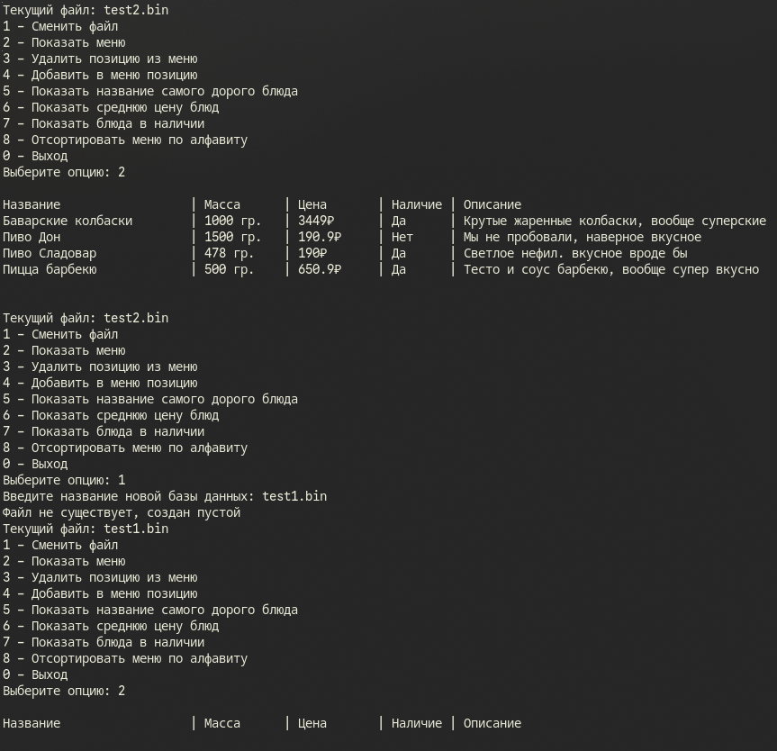
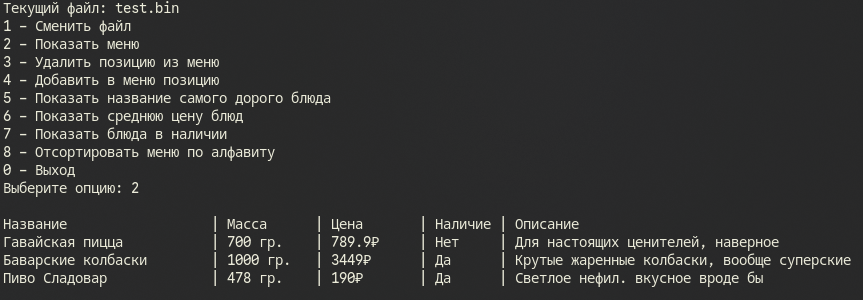
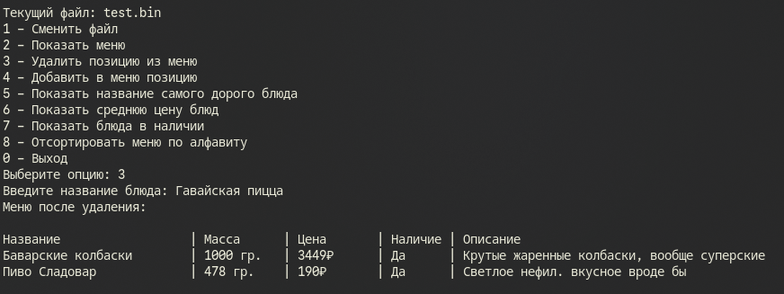
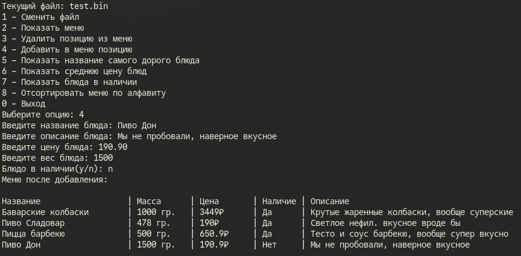
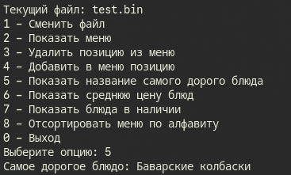
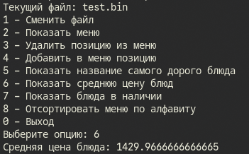
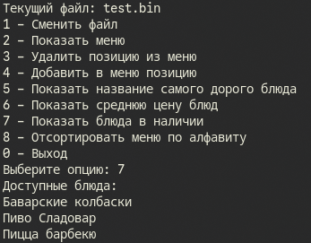
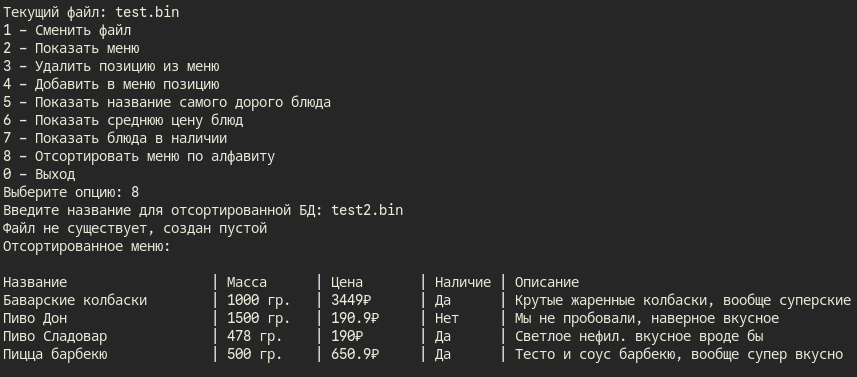

# Сурков Яков КМБ-1 Лабораторная №8

# Задание 1. LINQ-ЗАПРОСЫ 
## Задача 4
### Текст задачи 

Разработать консольное приложение с дружественным интерфейсом с возможностью выбора заданий для работы с «базой данных (БД)», хранящейся в бинарном файле. Перечень полей (минимум 5), достаточно полно характеризующих "Меню в кафе", предложить самостоятельно (постараться отразить в перечне полей такие, которые требуют разных типов данных).

Приложение должно выполнять следующие функции:
1. Чтение базы данных из бинарного файла.
2. Просмотр базы данных.
3. Удаление элементов (по ключу).
4. Добавление элементов.
5. Реализация 4 запросов (формулировки запросов придумать самостоятельно). 2 запроса должны возвращать перечень, 2 запроса одно значение. 

В классе должны присутствовать свойства, конструкторы, перегруженный метод ToString(). Весь функционал приложения реализовать в виде методов вспомогательного класса с помощью LINQ-запросов.

### Описание логики программы
Программа представляет собой систему управления базой данных меню, реализованную на основе бинарных файлов.

1. Инициализация и проверка файла:
При создании объекта базы данных задается имя файла. Программа проверяет, чтобы файл имел расширение .bin и не содержал недопустимых символов. Если файл не существует, он автоматически создается: в него записывается специальная сигнатура базы данных ("ourDB") и начальное количество элементов (0). Перед любым чтением или записью метод CheckFile проверяет наличие этой сигнатуры, защищая программу от попыток прочитать некорректные файлы.

2. Основные операции с данными (чтение, добавление, удаление):
    - Чтение (ReadData): Программа открывает бинарный файл, считывает количество записей, а затем в цикле последовательно считывает свойства каждого блюда (название, описание, цена, вес, статус наличия), формируя список объектов MenuItem.

    - Добавление (AddItem): Реализовано в двух вариантах. Программа может принять готовый объект блюда или запросить данные у пользователя через консоль (при вводе с консоли название, описание, цена и вес задаются пользователем, наличие определяется ответом "y/n"). При добавлении программа считывает текущий список, перезаписывает файл с увеличенным счетчиком элементов, записывает обратно старые блюда и добавляет в конец новое.

    - Удаление (DeleteItem): Программа запрашивает у пользователя название блюда, находит все совпадения в текущем списке, удаляет их и полностью перезаписывает бинарный файл обновленными данными с актуальным счетчиком элементов.

3. Обработка данных (с использованием LINQ):
В классе реализован ряд методов для аналитики и выборки данных из меню:

    MostExpensive() — сортирует список блюд по убыванию цены и возвращает название самого дорогого блюда.

    AveragePrice() — вычисляет и возвращает среднюю стоимость всех блюд в базе.

    AvailableDishes() — фильтрует список и возвращает названия только тех блюд, которые в данный момент есть в наличии (Available == true).

    SortMenu() — сортирует все блюда по названию в алфавитном порядке. После сортировки программа запрашивает имя для нового файла базы данных и сохраняет отсортированный список туда.

4. Вывод данных:
Для удобного отображения переопределен метод ToString(). Он считывает все данные из файла и формирует текстовую таблицу: «Название», «Масса», «Цена», «Наличие» и «Описание».

### Тестирование 

 

 
 
 
 
